International Cybersecurity and Digital Forensics Academy (ICDFA)

SBT-DF203: Basic Networking Skills for Digital Forensics

LAB 6: Firewall Traffic Control and Forensic Verification

| Course Code | SBT-DF203 |
| --- | --- |
| Registration Number | FWSD25/11424 |
| Course Title | Basic Networking Skills for Digital Forensics |
| Lab Number | Lab 6 |
| Lab Title | Firewall Traffic Control and Forensic Verification |
| Required Evidence | Baseline and blocked HTTP PCAPNG files; iptables ruleset exports |

# Executive Summary

This lab examined firewall traffic control and forensic verification using iptables, Apache, curl and TShark. The server was configured with Apache listening on TCP port 80 at 192.168.37.221, and a normal HTTP request was tested before applying a firewall rule. The baseline curl test successfully returned HTTP/1.1 200 OK and displayed the test HTML page. A narrowly scoped iptables INPUT rule was then created to DROP TCP traffic to port 80 from 192.168.56.20 and was verified as present. A blocked-traffic capture was started and the rule counter was checked afterward. However, the evidence screenshots show that the subsequent curl test was made to 192.168.37.221 from the same Kali environment and returned HTTP/1.1 200 OK, while the DROP rule counter remained at 0 packets. Therefore, the supplied evidence does not demonstrate that the blocking rule actually matched the tested traffic. The lab nevertheless demonstrates the correct forensic workflow of recording a baseline, creating and verifying a firewall rule, capturing traffic, checking rule counters, comparing allowed and blocked behaviour, and restoring the firewall state.

Learning Outcomes

Explain the purpose of host-based and network-based firewalls.

Interpret INPUT, OUTPUT and FORWARD chains.

Create, verify and remove a narrowly scoped iptables rule.

Capture allowed and blocked HTTP connection attempts.

Correlate packet evidence with firewall rule counters and application behaviour.

Explain DROP versus REJECT and identify retransmission/timeout evidence.

Restore the original ruleset safely.

Lab Folder Structure and Evidence Preparation

command used: mkdir -p ~/SBT-DF203-Lab6/{evidence,working,exported,reports,screenshots,scripts}

command used: cd ~/SBT-DF203-Lab6
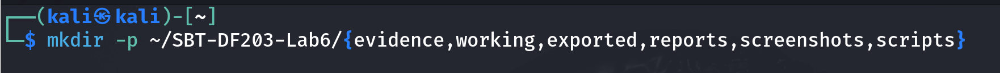

command used: pwd

command used: find . -maxdepth 1 -type d -print

Create the folder structure before downloading or generating evidence. Store original captures under evidence and analysis copies under working.
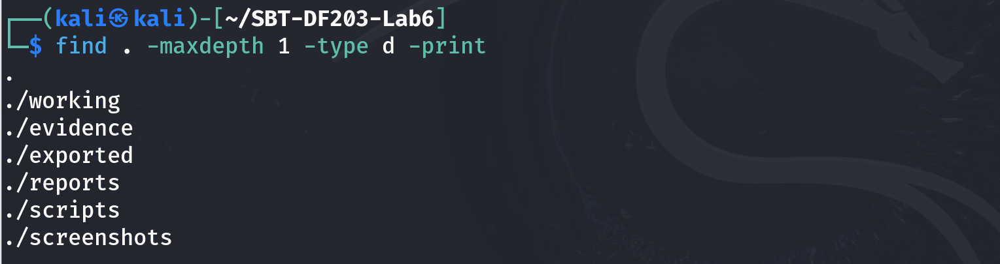

command used: sudo apt update
sudo apt install -y apache2 curl iptables tshark wireshark

command used: sudo systemctl enable --now apache2
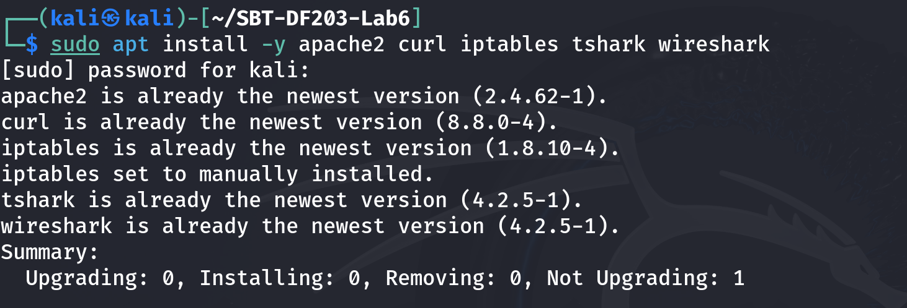

command used: printf '<!DOCTYPE html>\n<html><body><h1>ICDFA Network Forensics Firewall Lab</h1>
Server: testing server
</body></html>\n' | sudo tee /var/www/html/firewall_lab.html
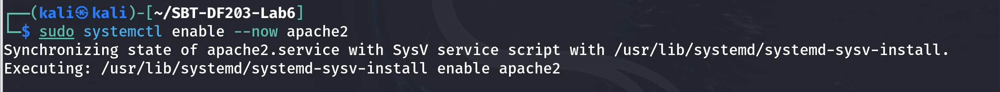

command used: sudo iptables-save | tee reports/iptables_before.rules
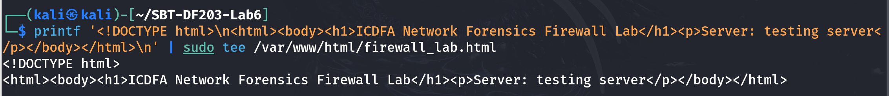

command used: sudo iptables -L -n -v --line-numbers | tee reports/iptables_before.txt

command used: sha256sum reports/iptables_before.rules | tee reports/iptables_before_sha256.txt
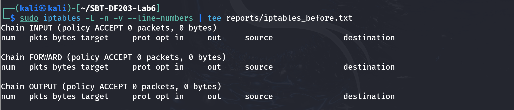

.
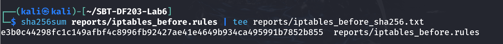

Mini Evidence and Chain-of-Custody Worksheet

| Field | Student Entry |
| --- | --- |
| Case/lab identifier | SBT-DF203-Lab6-Basiru-Aliyu |
| Trainee name | Basiru Aliyu |
| Date and time started | 18/09/2026 |
| Evidence file name(s) | http_allowed.pcapng; http_blocked.pcapng; iptables_before.rules |
| Source or generation method | Generated/captured during the firewall lab using TShark and iptables. |
| Original SHA-256 | 29860c150553884bf74bb9c9da84d2c3ca0b9742e046766bd6587fede2a1078 (http_allowed.pcapng); 9c43db4a32f52b781c5512e368ead3771c81c0a6c3015318ff3e3b591e6cad9d (http_blocked.pcapng) |
| Working-copy SHA-256 | No separate working-copy hash is shown in the supplied evidence. |
| Analysis workstation/VM | Kali Linux VM (VMware Workstation) |
| Notes on any changes | Firewall DROP rule was added for 192.168.56.20:80 and later removed. Evidence captures were generated during the lab. |

Part A - Record the Lab Network and Baseline Access

On the server
command used: ip -br address | tee reports/server_interfaces.txt

command used: ip route | tee reports/server_routes.txt
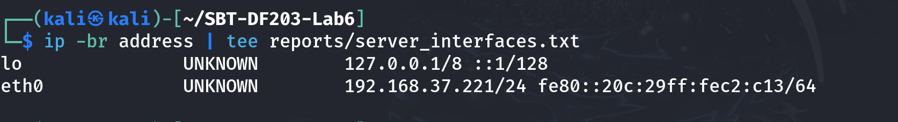

command used: sudo ss -lntp | grep ':80' | tee reports/apache_listener.txt

On the client, replace SERVER_IP
command used: curl -v --connect-timeout 5 http://SERVER_IP/firewall_lab.html 2>&1 | tee baseline_curl.txt
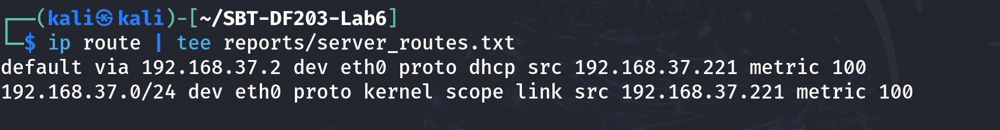
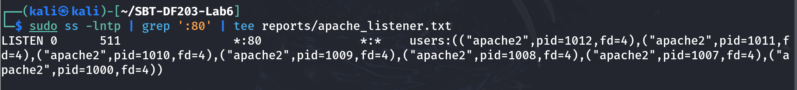

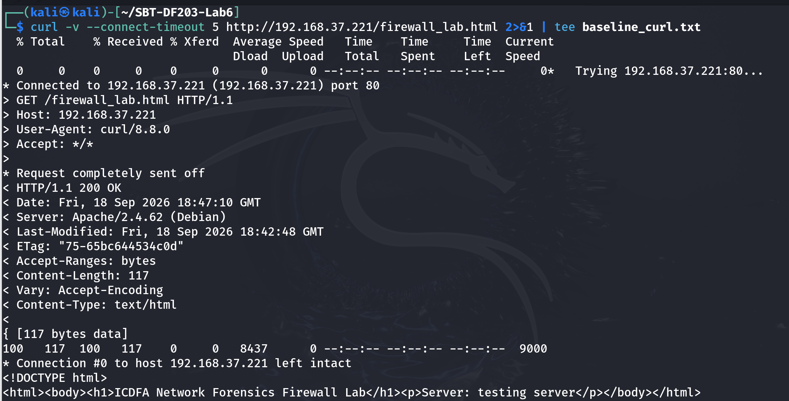

Part B - Capture the Allowed HTTP Baseline

On server, replace IFACE and CLIENT_IP
command used: sudo tshark -i eth0 -f 'host 192.168.37.221 and tcp port 80' -a duration:30 -w evidence/http_allowed.pcapng &
sleep 3

Run curl from client during this capture
command used: sha256sum evidence/http_allowed.pcapng | tee reports/http_allowed_sha256.txt
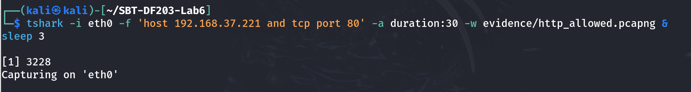

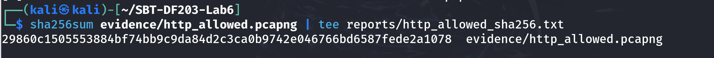

Part C - Apply and Verify the Blocking Rule

Use the exact source IP of the assigned blocked client. Insert the rule near the top of INPUT so it is evaluated before a broad ACCEPT rule.

command used: BLOCKED_CLIENT_IP=192.168.56.20
sudo iptables -I INPUT 1 -s "$BLOCKED_CLIENT_IP" -p tcp --dport 80 -j DROP
sudo iptables -L INPUT -n -v --line-numbers | tee reports/iptables_after_add.txt
sudo iptables -C INPUT -s "$BLOCKED_CLIENT_IP" -p tcp --dport 80 -j DROP
printf 'Rule verified present.\n' | tee reports/rule_verification.txt

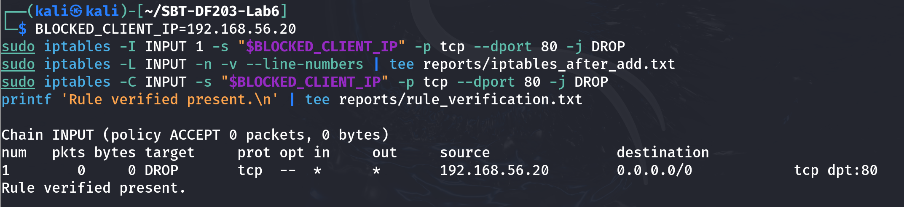

Part D - Capture Blocked Traffic and Rule Counters

On server
command used: sudo tshark -i 192.168.37.221 -f 'host 192.168.56.20 and tcp port 80' -a duration:35 -w evidence/http_blocked.pcapng &
sleep 3

From blocked client during capture:
command used:  curl -v --connect-timeout 10 http:// 192.168.37.221 /firewall_lab.html
wait

command used: sudo iptables -L INPUT -n -v --line-numbers | tee reports/iptables_after_test.txt
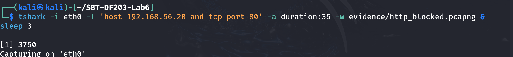
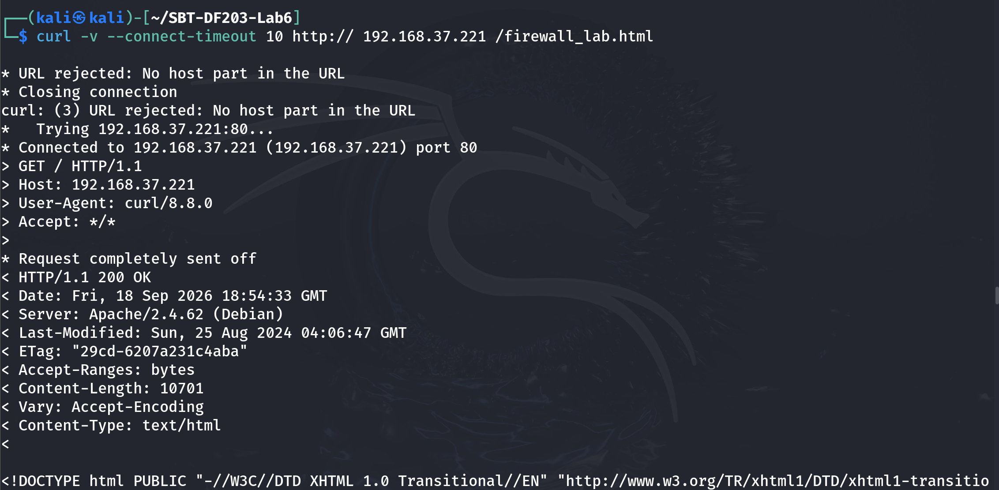

command used: sha256sum evidence/http_blocked.pcapng | tee reports/http_blocked_sha256.txt
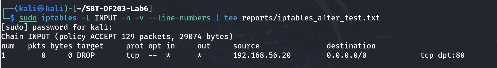

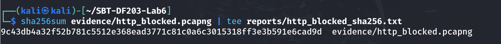

Part E - Compare Allowed and Blocked Captures

for PCAP in evidence/http_allowed.pcapng evidence/http_blocked.pcapng; do
  echo "===== $PCAP ====="
  tshark -r "$PCAP" -Y 'tcp.flags.syn==1 || http.request || http.response || tcp.analysis.retransmission' \
    -T fields -e frame.number -e frame.time_relative -e ip.src -e tcp.srcport -e ip.dst -e tcp.dstport \
    -e tcp.flags -e tcp.analysis.retransmission -e http.request.uri -e http.response.code
 done | tee reports/allowed_vs_blocked.tsv

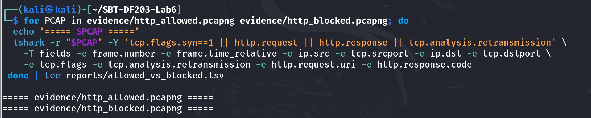

| Indicator | Allowed Capture | Blocked Capture |
| --- | --- | --- |
| Client SYN visible? | Yes — baseline HTTP connection was made. | No matching blocked-client packet is shown in the supplied evidence. |
| Server SYN-ACK visible? | Yes — the baseline curl connected successfully. | No matching SYN-ACK from the server is shown for 192.168.56.20. |
| Handshake completed? | Yes — HTTP request completed successfully. | No blocked-client handshake is demonstrated. |
| HTTP GET visible? | Yes — GET /firewall_lab.html was sent. | No blocked-client HTTP GET is demonstrated; the shown curl request returned 200 OK but was not demonstrated as coming from 192.168.56.20. |
| HTTP response visible? | Yes — HTTP/1.1 200 OK. | The shown curl returned HTTP/1.1 200 OK, so the test shown was not blocked. |
| Retransmissions/timeouts | None shown; request completed normally. | None shown. The test returned 200 OK rather than timing out. |
| iptables counter change | Not applicable to the blocked rule. | No change — DROP rule remained at 0 packets / 0 bytes. |
| curl result | HTTP/1.1 200 OK; page retrieved successfully. | HTTP/1.1 200 OK; therefore the displayed test did not exercise the intended DROP rule. |

13. Part F - Remove the Rule and Restore Access

command used:  _CLIENT_IP=192.168.56.20
sudo iptables -D INPUT -s "$BLOCKED_CLIENT_IP" -p tcp --dport 80 -j DROP
sudo iptables -C INPUT -s "$BLOCKED_CLIENT_IP" -p tcp --dport 80 -j DROP || echo 'Rule successfully removed'

command used: sudo iptables -L INPUT -n -v --line-numbers | tee reports/iptables_restored.txt
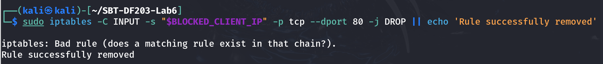

Confirm access from the previously blocked client
command used: curl -v --connect-timeout 5 http://SERVER_IP/firewall_lab.html
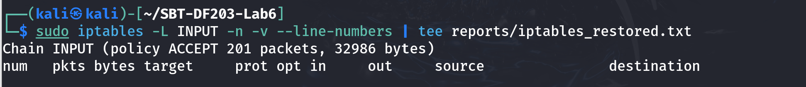

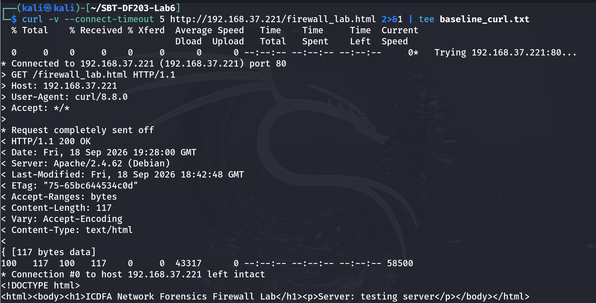

Part G - Optional NFQUEUE Observation

Explain that NFQUEUE passes matching packets to a userspace program.

Identify where a callback can accept, modify or drop the packet.

Document the rule, queue number, process and cleanup command.

Never leave an NFQUEUE rule active without a listening process because traffic may stall.

Forensic Interpretation Questions

Why does DROP commonly cause SYN retransmissions and a timeout?

How would a REJECT rule differ in the packet capture and client output?

Why are firewall counters valuable corroborating evidence?

What evidence would show that the web server was down rather than firewall-blocked?

ANSWER:

Evidence would include the server not listening on TCP port 80, such as no LISTEN entry from `ss -lntp`, the Apache service being stopped or failed, and the same connection failing even when the firewall rule is absent. Packet evidence would also help: if the server is down, the client may receive a TCP RST or otherwise fail because no application is accepting the connection. In contrast, a DROP rule normally leaves the connection attempt unanswered and can produce SYN retransmissions followed by a timeout.

What is the risk of deleting a rule by line number after other rules have changed?

ANSWER:
The line number can change when rules are inserted or removed. Deleting by the old line number may therefore remove the wrong firewall rule, potentially allowing unwanted traffic or blocking legitimate traffic. Deleting the rule by its exact matching conditions, as done in this lab, is safer because it targets the intended rule rather than relying on its current position.

# Conclusion

The firewall traffic control and forensic verification lab demonstrated how iptables rules can be created, verified, monitored and removed while network traffic is captured for forensic analysis. The baseline test confirmed that Apache was listening on port 80 and that the HTTP page could be retrieved successfully with a 200 OK response. A DROP rule for source 192.168.56.20 and destination port 80 was successfully inserted and verified. However, the post-rule test shown in the evidence also returned 200 OK and the iptables DROP counter remained at zero packets, indicating that the tested traffic did not match the blocked source address. Consequently, the supplied evidence does not prove a successful firewall block, even though the rule was correctly configured. The lab highlights the importance of correlating packet captures, application results and firewall counters rather than relying on the presence of a rule alone. Finally, the firewall rule was removed and the original state was checked during restoration.

# APPENDIX

# Short Explanation of Commands Used

The table below gives a short explanation of each command used in the lab.

| Command | Explanation |
| --- | --- |
| mkdir -p ~/SBT-DF203-Lab6/{evidence,working,exported,reports,screenshots,scripts} | Creates the Lab 6 directory structure for evidence, working files, reports, screenshots and scripts. |
| cd ~/SBT-DF203-Lab6 | Moves into the Lab 6 working directory. |
| pwd | Displays the current directory so the analyst can confirm the correct location. |
| find . -maxdepth 1 -type d -print | Lists the directories in the lab folder to verify that the required structure exists. |
| sudo apt update | Refreshes the package lists before installing required software. |
| sudo apt install -y apache2 curl iptables tshark wireshark | Installs Apache, curl, iptables, TShark and Wireshark for the firewall and traffic-forensics tasks. |
| sudo systemctl enable --now apache2 | Enables Apache to start automatically and starts the Apache service immediately. |
| printf '...HTML...' \| sudo tee /var/www/html/firewall_lab.html | Creates the test HTML page in Apache's web root and writes it to firewall_lab.html. |
| sudo iptables-save \| tee reports/iptables_before.rules | Exports the firewall ruleset before the test and saves it as evidence of the original state. |
| sudo iptables -L -n -v --line-numbers \| tee reports/iptables_before.txt | Lists iptables rules with packet/byte counters and line numbers and saves the output. |
| sha256sum reports/iptables_before.rules \| tee reports/iptables_before_sha256.txt | Calculates a SHA-256 hash of the original ruleset export for integrity verification. |
| ip -br address \| tee reports/server_interfaces.txt | Displays the server's interfaces and IP addresses in brief form and records the result. |
| ip route \| tee reports/server_routes.txt | Displays the server routing table and records it. |
| sudo ss -lntp \| grep ':80' \| tee reports/apache_listener.txt | Checks whether a TCP service is listening on port 80 and records the process information. |
| curl -v --connect-timeout 5 http://SERVER_IP/firewall_lab.html 2>&1 \| tee baseline_curl.txt | Makes a verbose baseline HTTP request, showing connection details, HTTP headers and the server response. |
| sudo tshark -i eth0 -f 'host 192.168.37.221 and tcp port 80' -a duration:30 -w evidence/http_allowed.pcapng & | Captures the allowed HTTP traffic for 30 seconds on eth0 and saves it to a PCAPNG file. |
| sleep 3 | Waits three seconds so the TShark capture is running before traffic is generated. |
| sha256sum evidence/http_allowed.pcapng \| tee reports/http_allowed_sha256.txt | Calculates and records the SHA-256 hash of the allowed HTTP capture. |
| BLOCKED_CLIENT_IP=192.168.56.20 | Stores the assigned blocked client's IP address in a shell variable. |
| sudo iptables -I INPUT 1 -s "$BLOCKED_CLIENT_IP" -p tcp --dport 80 -j DROP | Inserts a rule at the top of INPUT to silently drop TCP port 80 traffic from the specified source IP. |
| sudo iptables -L INPUT -n -v --line-numbers \| tee reports/iptables_after_add.txt | Displays the INPUT chain with counters and line numbers to verify the new rule. |
| sudo iptables -C INPUT -s "$BLOCKED_CLIENT_IP" -p tcp --dport 80 -j DROP | Checks whether the exact DROP rule exists in the INPUT chain. |
| printf 'Rule verified present.\n' \| tee reports/rule_verification.txt | Records confirmation that the firewall rule was verified. |
| sudo tshark -i eth0 -f 'host 192.168.56.20 and tcp port 80' -a duration:35 -w evidence/http_blocked.pcapng & | Captures traffic matching the blocked client and HTTP port for 35 seconds. |
| curl -v --connect-timeout 10 http://192.168.37.221/firewall_lab.html | Tests HTTP access from the environment after the DROP rule was applied. |
| sudo iptables -L INPUT -n -v --line-numbers \| tee reports/iptables_after_test.txt | Checks the firewall counters after the test to determine whether the DROP rule matched packets. |
| sha256sum evidence/http_blocked.pcapng \| tee reports/http_blocked_sha256.txt | Calculates and records the SHA-256 hash of the blocked-traffic capture. |
| for PCAP in evidence/http_allowed.pcapng evidence/http_blocked.pcapng; do ... done \| tee reports/allowed_vs_blocked.tsv | Processes both captures with TShark and extracts SYNs, HTTP requests/responses and retransmissions for comparison. |
| sudo iptables -D INPUT -s "$BLOCKED_CLIENT_IP" -p tcp --dport 80 -j DROP | Removes the exact DROP rule from the INPUT chain during restoration. |
| sudo iptables -C INPUT -s "$BLOCKED_CLIENT_IP" -p tcp --dport 80 -j DROP \|\| echo 'Rule successfully removed' | Checks whether the rule still exists; if it does not, it prints a confirmation message. |
| sudo iptables -L INPUT -n -v --line-numbers \| tee reports/iptables_restored.txt | Lists and records the restored INPUT chain. |
| curl -v --connect-timeout 5 http://SERVER_IP/firewall_lab.html | Confirms HTTP access after the firewall rule has been removed. |
